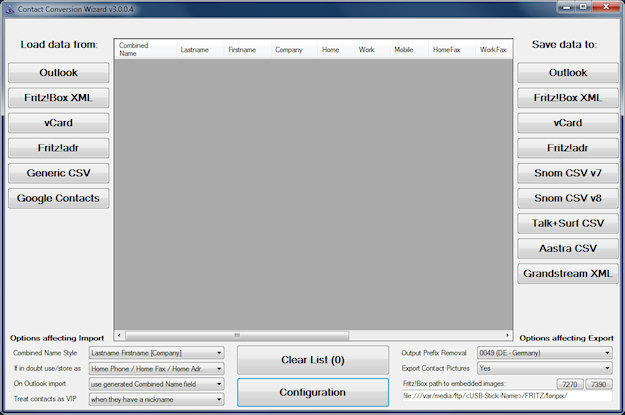

# Contact-Conversion-Wizard

Programm um auf einfache Weise Kontaktlisten zwischen verschiedenen Programmen/Geräten zu konvertieren

## Einsatzzweck

Ursprünglich entstand das Programm da dem Autor die existierenden Methoden das Outlook Telefonbuch in die Fritz!Box zu übernehmen zu umständlich waren.

Aus dem dem hierfür geschriebenen Programm (ursprünglich ein reines Outlook-zu-Fritz!Box Konvertierprogramm) im Laufe der Zeit ein universelles Kontaktlisten-Umwandlungs-Tool geworden das Kontakte aus einer ganzen Reihe von Quellen importieren kann und eine vielzahl [interessanter Formate](formate.md) wieder exportieren kann.

## Quellcode

Das Programm ist in C# geschrieben (Lizenz GPLv3). Binaries (`.exe`) zum Herunterladen gibt es in den [Releases](https://github.com/Rillke/Contact-Conversion-Wizard/releases). Wie bei C#/.NET Programmen üblich ist es auch unter [Linux](linux.md) lauffähig, sofern man eine aktuelle Mono Runtime installiert hat (natürlich ohne Outlook Support).

## Screenshot

